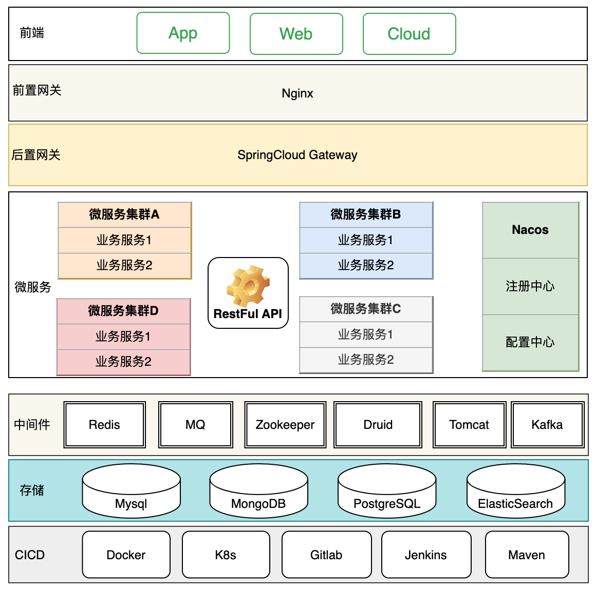
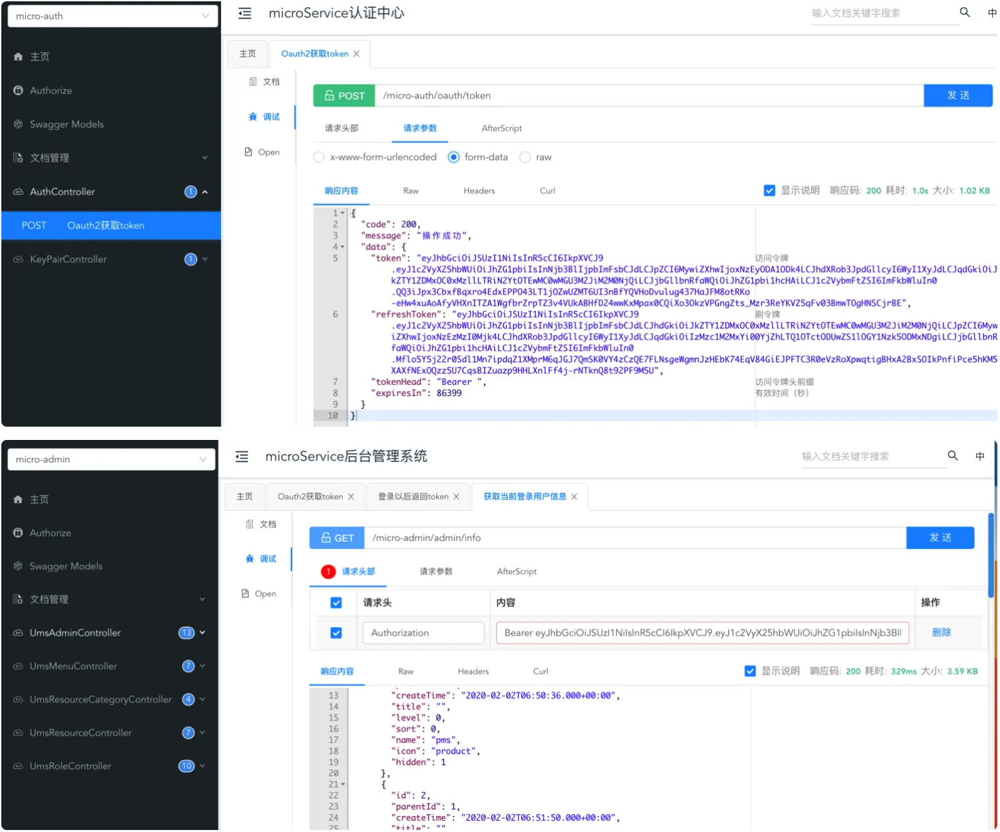
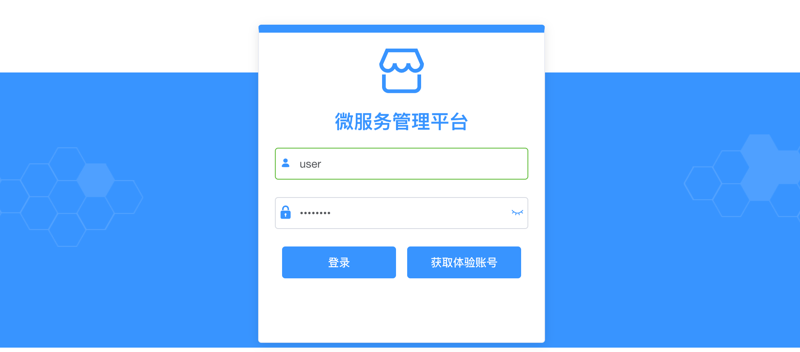
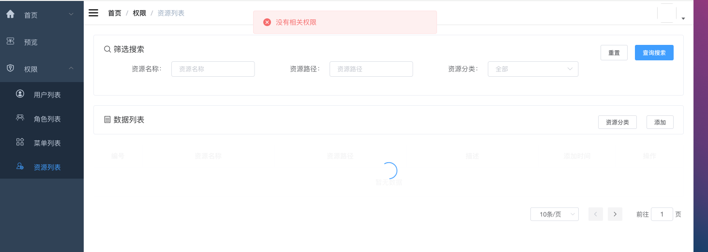

## 项目简介

- `easy-micro`是一个简化微服务开发的脚手架，后端采用SpringBoot/SpringCloud+MyBatis+Oauth2、前端VUE，拥有完整权限管理功能，便于快速定制业务,开箱即用。

## 特性
- Less is More，核心模块仅包含网关和鉴权，方便业务定制
- Gateway负责统一登录认证和访问控制，后端微服务安全无感
- Auth负责登录认证、封装token
- 前端VUE提供完整权限功能，动态控制菜单展示和API授权
- 接口文档清晰、调试可视化，[部署文档](https://www.yuque.com/u1862689/owg1ex/bfltehvynfgccon9?singleDoc#qSteZ)

## 技术架构


## 项目演示






## 项目结构
````   
├── micro-gateway         // 网关服务 [8201]
├── micro-auth            // 认证服务 [9401]
├── micro-common          // 通用模块                      
├── micro-modules         // 业务模块
│       └── micro-admin                           // 聚合微服务/元数据服务，对接前端 [8080]
│       └── micro-custom                          // 用户业务微服务demo
├──pom.xml  
````

## 技术选型

| 技术                     | 说明            |
|------------------------|---------------|
| SpringBoot             | 容器+MVC框架      |
| SpringCloud            | 微服务框架         |
| SpringCloud Alibaba    | 微服务框架         |
| Spring Security Oauth2 | 认证授权框架        |
| MyBatis                | ORM框架         |
| PageHelper             | Mybatis物理分页插件 |
| MyBatisGenerator       | mapper自动生成    |
| Redis                  | 分布式缓存         |
| Nginx                  | 静态资源服务器       |
| Hutool                 | java工具类库      |

