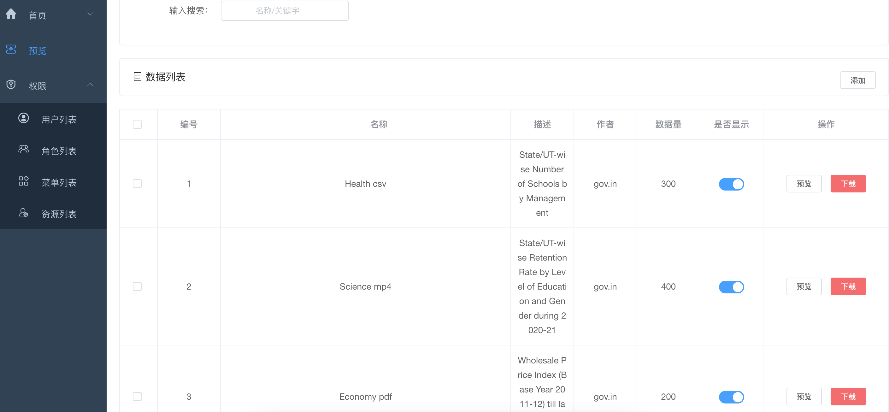

## 项目简介

- `easy-micro`是一个简化微服务开发的脚手架，后端采用SpringBoot/SpringCloud+MyBatis+Oauth2、前端VUE，拥有完整的权限管理功能，开箱即用。
- 学习[mall](https://github.com/macrozheng/mall)，致敬经典，形成微服务开发脚手架，便于快速定制扩展业务，期望对读者有所启发。

## 特性
- Less is More，核心模块仅包含网关和鉴权，方便业务定制
- Gateway负责统一登录认证和访问控制，后端微服务安全无感
- Auth负责登录认证、封装token
- 前端VUE提供完整权限功能，动态控制菜单展示和API授权
- 接口文档清晰、调试可视化，[部署文档](https://www.yuque.com/u1862689/owg1ex/bfltehvynfgccon9?singleDoc#qSteZ)


## 技术架构


## 项目演示





## 项目结构
````   
├── micro-gateway         // 网关服务 [8201]
├── micro-auth            // 认证服务 [9401]
├── micro-common          // 通用模块                      
├── micro-modules         // 业务模块
│       └── micro-admin                           // 聚合微服务/元数据服务，对接前端 [8080]
│       └── micro-demo                            // 用户业务微服务 
├──pom.xml  
````
## 技术选型

## 参考文献
- [mall](https://github.com/macrozheng/mall)
